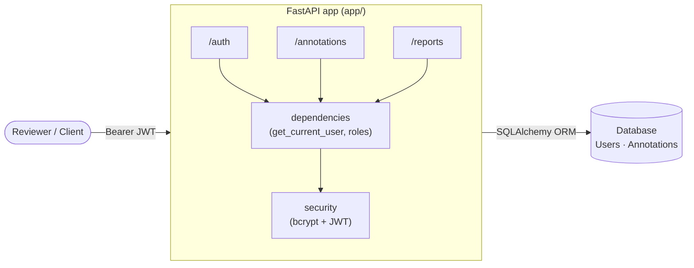
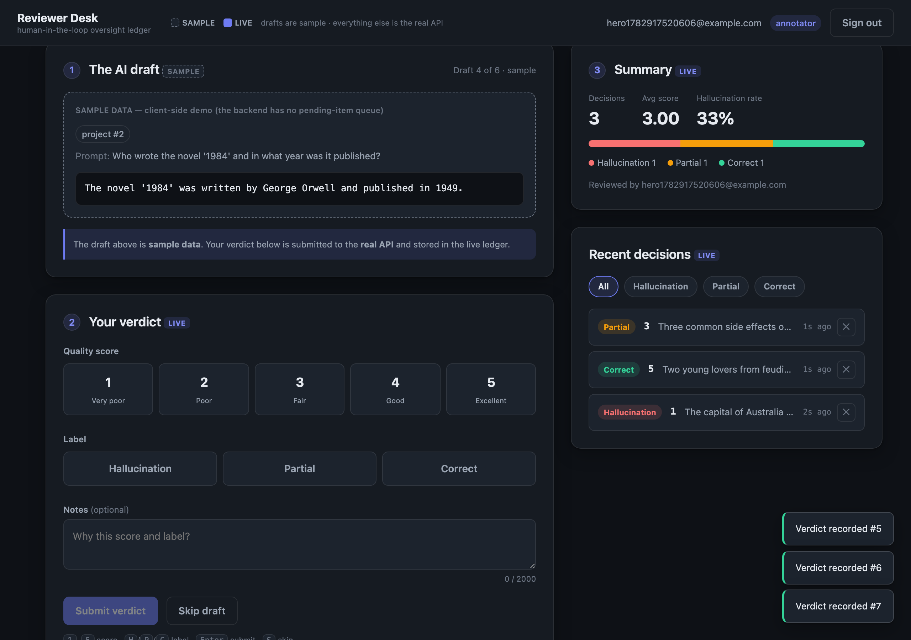
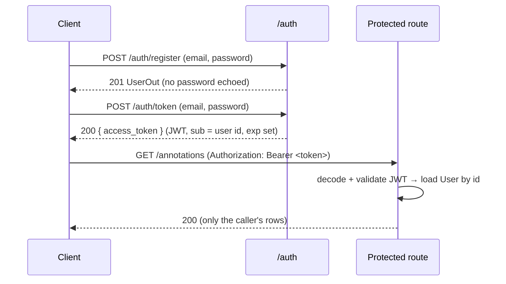

# LLM Annotation Platform

> A FastAPI backend for collecting and reporting **human quality ratings on LLM outputs**: the data-collection layer behind RLHF, model evaluation, and hallucination detection.


---

## 🧭 The bigger picture

This ships as an API for scoring LLM outputs, but the engine underneath is more
general: **an always-on checkpoint that runs an AI's proposal past an accountable
human before any decision is committed, then records who decided, what, and why.**
The same loop that scores LLM outputs for RLHF is, unchanged, a governance control
plane for AI actions proposed into Jira / Slack / Salesforce, or a licensed-pharmacist
sign-off in a hospital.

> AI proposes → an authenticated human rules → the verdict is recorded, attributed, and reported.

**→ Read the full story in [VISION.md](VISION.md).** It covers the algorithm-vs-AI rationale,
the two-layer "Swiss-cheese" accountability model, and worked use cases in
project/program/portfolio governance and healthcare.

---

## Overview

When a team trains, fine-tunes, or ships an LLM, they need a way to turn raw model
outputs into **structured, attributable human judgments**. This service is that
layer. Human reviewers ("annotators") authenticate, then submit a judgment on a
single model output:

- a **1 to 5 quality score**,
- a categorical **label** (`hallucination`, `correct`, or `partial`),
- optional free-text **notes**,
- all scoped to an **evaluation project** (`project_id`).

Every judgment is attributed to the reviewer who made it, and a reporting endpoint
aggregates review volume, per-label breakdowns, and mean score: the raw material
for metrics like *hallucination rate per model version*.

In short: it is the ingestion and storage backbone of a human-in-the-loop LLM
evaluation pipeline.

### Scope & honesty

This is a **focused reference implementation**, not a Scale/Surge competitor. It is
intentionally small enough to read in one sitting, but built the way a real service
would be: env-driven configuration, hashed passwords, JWT auth with expiry,
object-level authorization, database-level constraints, an isolated test suite, and
a working CI pipeline with security scanning. The [Roadmap](#roadmap) lists the
credible next steps toward a full platform.

---

## Use cases

| Use case | How this service supports it |
| --- | --- |
| **RLHF preference-data collection** | Annotators score completions 1 to 5 to build the reward-model / preference dataset, with every rating attributed to a reviewer and project for auditability. |
| **Hallucination detection & tracking** | Reviewers apply the `hallucination` / `correct` / `partial` label; the summary report is the foundation for computing hallucination rates per model or prompt category. |
| **Model-version eval & regression benchmarking** | Scope annotations to a `project_id` to gather human scores for a fixed eval set against each checkpoint and compare quality across releases. |
| **Data-labeling vendor workflows** | JWT auth + roles let a vendor onboard a pool of annotators, attribute each judgment to its reviewer, and report throughput, giving the accountability layer needed to audit label quality. |
| **Red-team & safety incident logging** | Trust-and-safety reviewers record structured verdicts (score + label + notes) on unsafe outputs, producing a searchable, authenticated log to feed safety fine-tuning. |
| **Human-QA gate for production LLM features** | Route sampled outputs through the API for human sign-off before promoting a model or prompt change, using the summary report to confirm a quality bar was met. |

---

## Features

- 🖥️ **Reviewer UI**: a zero-dependency single-page console at `/ui` to work the loop live: grade a sample AI draft (score + label + notes) and watch it land in the real, attributed decision ledger. Keyboard-first, accessible, dark theme.
- 🔐 **JWT authentication**: register, log in for a bearer token, hit protected routes. Passwords stored as bcrypt hashes, never plaintext.
- 👤 **Role-based access**: `annotator` vs `admin`; annotators are scoped to their own data. The role is **not** client-settable: self-registration is always an annotator, and admins are provisioned out-of-band (DB seed / CLI).
- 📝 **Annotation CRUD**: create, read, list (paginated + filterable), delete, with per-owner authorization.
- 📊 **Aggregate reporting**: total volume, per-label breakdown, and average score.
- 🛡️ **Defense in depth**: Pydantic validation at the edge *and* `CHECK` constraints in the database.
- 🧪 **Real test suite**: isolated per-test database, exact status-code assertions, auth/authz/round-trip coverage.
- ⚙️ **CI/CD**: lint (ruff) + tests across Python 3.11 to 3.13, plus a CodeQL security scan.

---

## Tech stack

| Concern | Choice |
| --- | --- |
| Language | Python 3.11+ |
| Web framework | FastAPI |
| ORM | SQLAlchemy 2.0 (typed, synchronous) |
| Validation | Pydantic v2 + `pydantic-settings` |
| Auth | `python-jose` (JWT) + `bcrypt` |
| Database | SQLite (dev) → Postgres-ready |
| Tests | pytest + Starlette `TestClient` |
| Lint | ruff |

---

## Architecture



Layout:

```
app/
├── main.py           # app factory, router wiring, lifespan (schema create), CORS, /health
├── config.py         # pydantic-settings: all config from env / .env
├── database.py       # sync engine, SessionLocal, get_db dependency, Base
├── models.py         # SQLAlchemy 2.0 models: User, Annotation (+ Role/Label enums, CHECK constraints)
├── schemas.py        # Pydantic request/response contracts
├── security.py       # password hashing + JWT create/decode
├── dependencies.py   # get_current_user, role guards, typed Depends aliases
├── routers/
│   ├── auth.py         # POST /auth/register, POST /auth/token, GET /auth/me
│   ├── annotations.py  # POST/GET/DELETE /annotations, GET /annotations (list)
│   └── reports.py      # GET /reports/summary
└── static/ui/         # Reviewer UI: index.html + app.css + app.js, served at /ui
tests/                 # conftest (isolated DB) + auth/annotation/report/ui tests
```

See [REFACTORING.md](REFACTORING.md) for a detailed, senior-engineer walkthrough of how
this evolved from the original prototype and *why* each decision was made.

---

## Getting started

**Prerequisites:** Python 3.11+.

```bash
git clone https://github.com/Microchip911/llm-annotation-platform.git
cd llm-annotation-platform

python -m venv .venv
source .venv/bin/activate            # Windows: .venv\Scripts\activate
pip install -r requirements-dev.txt  # runtime + test/lint tooling

cp .env.example .env                 # optional; sensible defaults work out of the box
```

Run the API:

```bash
uvicorn app.main:app --reload
```

Then open:

- the **Reviewer UI** at **http://127.0.0.1:8000/ui** (the site root redirects there), a single-page console to work the loop live, and
- the interactive **API docs** at **http://127.0.0.1:8000/docs** (Swagger UI, where the "Authorize" button works: register, log in, paste the token, try every endpoint).

[](docs/reviewer-desk.png)

*The Reviewer Desk: grade a sample AI draft on the left; the real, attributed decision ledger and live summary update on the right. Drafts are client-side sample data; every verdict is a real API call.*

> **▶️ View the UI: run it, don't open the file.** The UI is served *by* the app and talks to the API, so it only works through the running server. From the project root, with the virtualenv active (`source .venv/bin/activate`):
> ```bash
> SECRET_KEY=dev-secret uvicorn app.main:app --reload
> ```
> then open **http://127.0.0.1:8000/ui** in your browser. (Opening `index.html` on its own just shows an inert page; there's no backend behind it. If `uvicorn` reports `No module named 'bcrypt'`, your virtualenv isn't active: run `source .venv/bin/activate` first, or call `.venv/bin/uvicorn` directly.)

Run the tests / linter:

```bash
pytest
ruff check .
```

---

## Configuration

All settings are read from environment variables (or a local `.env`). Defaults are
dev-friendly; override anything sensitive in production. See [`.env.example`](.env.example).

| Variable | Default | Purpose |
| --- | --- | --- |
| `SECRET_KEY` | *ephemeral random* | JWT signing key. **Set a stable value in production** (unset ⇒ tokens don't survive a restart). |
| `ALGORITHM` | `HS256` | JWT signing algorithm. |
| `ACCESS_TOKEN_EXPIRE_MINUTES` | `60` | Token lifetime. |
| `DATABASE_URL` | `sqlite:///./app.db` | SQLAlchemy URL. Swap for `postgresql+psycopg://…` in prod. |
| `SQL_ECHO` | `false` | Log emitted SQL. |
| `CORS_ORIGINS` | `["*"]` | Allowed CORS origins (JSON list). |

---

## API reference

| Method | Path | Auth | Description |
| --- | --- | --- | --- |
| `POST` | `/auth/register` | none | Create a reviewer account (always an `annotator`). |
| `POST` | `/auth/token` | none | Exchange email + password for a JWT. |
| `GET` | `/auth/me` | ✅ | Current authenticated user. |
| `GET` | `/auth/users` | 🔑 admin | List all users (oversight view). |
| `POST` | `/annotations/` | ✅ | Submit an annotation (attributed to you). |
| `GET` | `/annotations/` | ✅ | List your annotations (filters: `label`, `project_id`; `skip`/`limit`). |
| `GET` | `/annotations/{id}` | ✅ | Fetch one annotation you own. |
| `DELETE` | `/annotations/{id}` | ✅ | Delete one annotation you own. |
| `GET` | `/reports/summary` | ✅ | Aggregate stats scoped to you (all data for admins). |
| `GET` | `/ui` | none | Reviewer UI (single-page console; `/` redirects here). |
| `GET` | `/health` | none | Liveness probe. |

### Example session

```bash
# 1) Register
curl -X POST localhost:8000/auth/register \
  -H 'Content-Type: application/json' \
  -d '{"email":"reviewer@example.com","password":"password123"}'
# → {"id":1,"email":"reviewer@example.com","role":"annotator","created_at":"..."}

# 2) Log in → capture the token
TOKEN=$(curl -s -X POST localhost:8000/auth/token \
  -d 'username=reviewer@example.com&password=password123' | jq -r .access_token)

# 3) Submit two annotations
curl -X POST localhost:8000/annotations/ \
  -H "Authorization: Bearer $TOKEN" -H 'Content-Type: application/json' \
  -d '{"project_id":42,"llm_output":"The Eiffel Tower is in Berlin.","score":1.0,"label":"hallucination","notes":"Wrong city."}'
# → {..., "id":1, "user_id":1, "label":"hallucination"}

curl -X POST localhost:8000/annotations/ \
  -H "Authorization: Bearer $TOKEN" -H 'Content-Type: application/json' \
  -d '{"project_id":42,"llm_output":"Water boils at 100C at sea level.","score":5.0,"label":"correct"}'

# 4) Aggregate report
curl localhost:8000/reports/summary -H "Authorization: Bearer $TOKEN"
# → {"total_annotations":2,"by_label":{"hallucination":1,"correct":1,"partial":0},
#    "average_score":3.0,"reviewed_by":"reviewer@example.com"}
```

---

## Authentication & authorization



- **Authentication**: bearer JWTs signed with `HS256`; the algorithm list is pinned on decode to prevent `alg=none` / algorithm-confusion attacks, and expiry is always enforced.
- **Authorization**: annotators only see and mutate their **own** annotations; admins see all. Non-owner reads return **404 (not 403)** so the API never leaks the existence of another reviewer's data.
- **Role provisioning**: registration always creates an `annotator`; `role` is never accepted from the client. Admin accounts are seeded out-of-band, closing the "self-service admin" escalation.

---

## Testing

```bash
pytest
```

Tests run against the **real application stack** but against a throwaway SQLite
database in the OS temp dir, with a fixed test secret and a fresh schema per test.
Coverage includes: registration/login, token validity/expiry/tampering,
create→read round-trips, `422` validation failures, and ownership/IDOR scoping.

---

## CI/CD & security scanning

[`.github/workflows/ci.yml`](.github/workflows/ci.yml) runs on every push and PR:

- **Lint & test** across Python 3.11, 3.12, and 3.13 (`ruff check` + `pytest`).
- **CodeQL** static security analysis (`init` → `analyze`).

---

## Roadmap

Credible next steps toward a production labeling platform:

- **Postgres** + **Alembic** migrations (replace `create_all`).
- **Inter-annotator agreement** metrics (e.g. Cohen's κ) for label reliability.
- Richer reporting: **hallucination rate**, per-project and per-model breakdowns, time series.
- **Project** and **assignment** models (who reviews what).
- Rate limiting, structured logging, and OpenTelemetry tracing.
- Container image + `docker-compose` for a prod-like local stack.

---

## License

[MIT](LICENSE) © 2026 Segun Ashaolu
