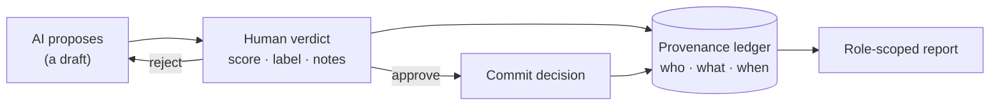
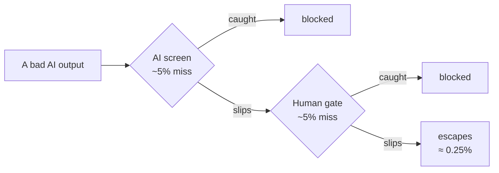
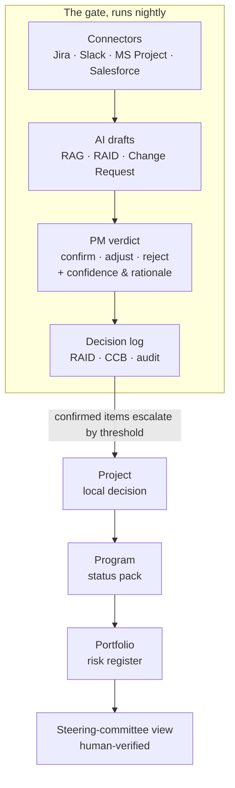
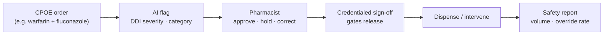

# The bigger picture

> **From "LLM annotation platform" to a human-in-the-loop decision & oversight ledger.**

This repository ships as an API for scoring LLM outputs. But the engine underneath
is more general and, honestly, more interesting than "a labeling tool." This
document is the story of what it really is, why it matters, and where it applies.

---

## The reframe

Strip the project to its core and you find a single, reusable loop:

> **An AI proposes → an authenticated human rules → the verdict is recorded, attributed, and reported.**

That is not a feature. It's a **capability**: an always-on, never-tired checkpoint
that sits between an AI's *proposal* and a *committed decision*, and refuses to let
anything through without a named human's verdict **on the record**.

Framed that way, this isn't an app competing with other apps. It's an
**infrastructure layer**, like authentication, logging, or version control: a
horizontal control plane that any AI-assisted workflow can plug into. Scoring LLM
outputs for RLHF is simply the *first* instance of the pattern. The same loop is,
unchanged, a governance control plane for AI actions proposed into Jira, Slack, or
Salesforce, or a licensed-pharmacist sign-off in a hospital.

You're not selling software; you're selling a guarantee:
**no AI-influenced decision gets committed without an accountable human on the record.**

### The core loop

Every label maps **1:1 onto the shipped database schema** (`llm_output`, `score`,
`label`, `notes`, `user_id`, `created_at`) and the role-scoped `/reports/summary`
endpoint. This is the real engine, not a metaphor.

---

## Why the human gate exists: algorithm vs. AI

The gate isn't bureaucracy; it exists for a precise reason.

- An **algorithm** is *deterministic*: defined rules, if/else, provably correct. You
  would never build a system for humans to "grade" a sort function; it's either
  right or it's a bug. No gate needed.
- An **AI / LLM** is *probabilistic*: it's brilliant at nuance and ambiguity, and it
  can be **confidently wrong**. Its outputs are **judgments, not computations**, so
  in anything high-stakes or nuanced, they need *human judgment* on top.

That's the whole reason this layer exists: to put an accountable human between a
probabilistic proposal and an irreversible decision.

---

## The "double point of failure": why two layers beat one

A recurring worry is *"but humans make errors too, and so does the AI."* Exactly:
that's the point, not the problem. Requiring **two independent layers** to pass
is a well-established safety principle: James Reason's **Swiss-cheese model**, the
**four-eyes principle**, and **separation of duties** (SOX / ISO 27001 / SOC 2).

The math is the pitch. If the AI layer alone misses ~1 in 20 (5%) and an independent
human also misses ~1 in 20 of what they see, then for a bad output to actually get
committed it must defeat **both** gates. If the layers fail *independently*, that's
roughly `5% × 5% = 0.25%`: **one in four hundred, not one in twenty.** You didn't
make either reviewer smarter; you made their blind spots have to coincide.

The key word is **independent**: the multiplier only holds because the two layers
fail for *different reasons*. The human catches confident-but-wrong AI mistakes the
model can't see in itself, and the AI catches volume and consistency a tired human
would miss. That diversity is the entire reason for pairing a probabilistic AI with
a human judge.

### Accountability becomes shared, and *locatable*

In a single-layer world, when something goes wrong there's "one throat to choke,"
usually the last human who touched it. That's both unfair (they were set up to fail)
and useless (it hides the real cause). With a recorded two-layer loop, every
committed decision carries a full provenance chain: *the AI proposed X; a named
authority reviewed it at a timestamp and recorded verdict Y, with reasoning.*

Failure attribution is then **distributed across the system that produced it**. Was
it a bad AI proposal, a rushed review process, or a genuine human misjudgment?
That replaces collapsing onto an individual. That is Reason's central reframing:
**from "who is to blame" to "why did the layers fail."**

---

## Primary use case: project, program & portfolio governance

Decision-tracking *is* the craft of project management. Through Jira, MS Project, or
a spreadsheet, it's all about tracking and making defensible calls. This engine is
an always-on governance layer for exactly that.

**How it plays out.** Overnight, the engine polls the connectors (Jira velocity and
blockers, MS Project baseline vs. actuals on the critical path, a Slack thread where
the vendor mentioned a slip, the Salesforce contractual go-live date) and it
*drafts* a governance move against a project:

> *"Status **Amber** (was Green). Critical path slipping ~2 weeks; SPI trending 0.86.
> Driver: risk R-217 (vendor sandbox unavailable) has materialized. Recommend: flip
> RAG, promote R-217 to an Issue, raise a schedule Change Request, and escalate, since the
> slip breaches the contractual go-live."*

Each item lands as a **draft, not a fact.** A named PM with authority rules on each
(confirm, adjust, or reject) with a **confidence score** and written **rationale**.
Confirmed items that breach a threshold escalate **up** the Portfolio → Program →
Project hierarchy, so the steering committee sees a **human-verified rollup**, never
raw AI noise. And when an auditor asks *"who decided this, and on what basis?"*, the
answer is one query, not an archaeology dig through email and Slack.

### The decision ledger: the board-ready audit trail

This is the evidentiary payoff, rendered as the artifact itself:

| AI proposal (draft) | Verdict | Conf. | Rationale (notes) | Decided by | Time | Escalated |
|---|---|:--:|---|---|:--:|---|
| Flip RAG → Amber | ✅ **Confirm** | 5 | Vendor confirmed outage in writing | Amara · PM | 08:30 | Program |
| Critical path slips ~2 wks | 🟠 **Adjust** | 3 | Secured partial sandbox → re-forecast 1 wk | Amara · PM | 08:32 | Program |
| Auto-raised Change Request | ❌ **Reject** | 4 | Hold until Thursday's vendor call | Amara · PM | 08:35 | none *(open)* |

Each row is a reconstructable provenance chain, and each maps 1:1 onto the shipped
`Annotation` schema (`llm_output · label · score · notes · user_id · created_at`). In
regulatory terms, this *is* **EU AI Act Article 14 (human oversight)** plus **Article
12 (record-keeping)** evidence, produced as a byproduct of normal use.

**The value, to a PM:**

- **Auditable, defensible decisions**: who proposed, who ruled, the confidence, the
  rationale, the timestamp. One query, not a hunt.
- **Structured risk escalation** across the P3 hierarchy: the board sees a filtered,
  human-verified view, mirroring how the shipped role-scoped `/reports/summary` only
  aggregates what the viewer is entitled to.
- **Trust calibration over time**: because every proposal is scored, the ledger
  accumulates a track record. If RAG calls are confirmed 95% of the time, grant the
  engine more autonomy; if cost forecasts are adjusted 60% of the time, keep a tight
  gate. Calibration is *earned from data*, not assumed.

---

## Secondary use case: healthcare (pharmacy)

The same loop, but here the human sign-off is a **legal requirement**, not a
convenience.

An AI medication-safety flag (a drug-drug interaction, a dosage anomaly) is a
**proposal only**. A licensed pharmacist's attributed, timestamped verdict is the
**decision of record**: nothing dispenses on the AI's say-so. For high-alert drugs
(anticoagulants, insulin, opioids, chemotherapy), this independent double-check is
exactly the four-eyes rule pharmacy **already mandates**. The credentialed sign-off
is simultaneously the safety gate, the compliance evidence (EU AI Act / FDA SaMD),
and the audit trail that protects a diligent clinician.

---

## Why now

Two curves are crossing:

1. **AI is being wired into everything** through connectors / MCP (Claude connectors,
   Salesforce, Slack, Jira). AI increasingly *proposes actions*, not just answers.
2. **Regulation is catching up**: the EU AI Act and similar frameworks now *mandate*
   human oversight and record-keeping for high-risk AI.

The value and the risk both concentrate at the **human-checkpoint layer**, and today
that layer is usually a Slack thread, a spreadsheet, or someone's memory: no
accountability, no audit trail, no way to measure whether the AI is even trustworthy.
A clean, authenticated, auditable "AI-proposed / human-decided / here's the tally"
ledger is precisely the missing governance substrate.

---

## What ships today vs. the vision

To be honest about scope: this repository implements the **RLHF / model-evaluation
instance** of the loop, meaning the engine, the schema, JWT auth with role-scoping, per-owner
authorization, and aggregate reporting. The project-management and healthcare
applications above describe the **same engine, differently skinned**; they are the
extensibility story and the roadmap, not claims about shipped connectors.

See the [README](README.md) for what runs today and [REFACTORING.md](REFACTORING.md)
for how it was built.
